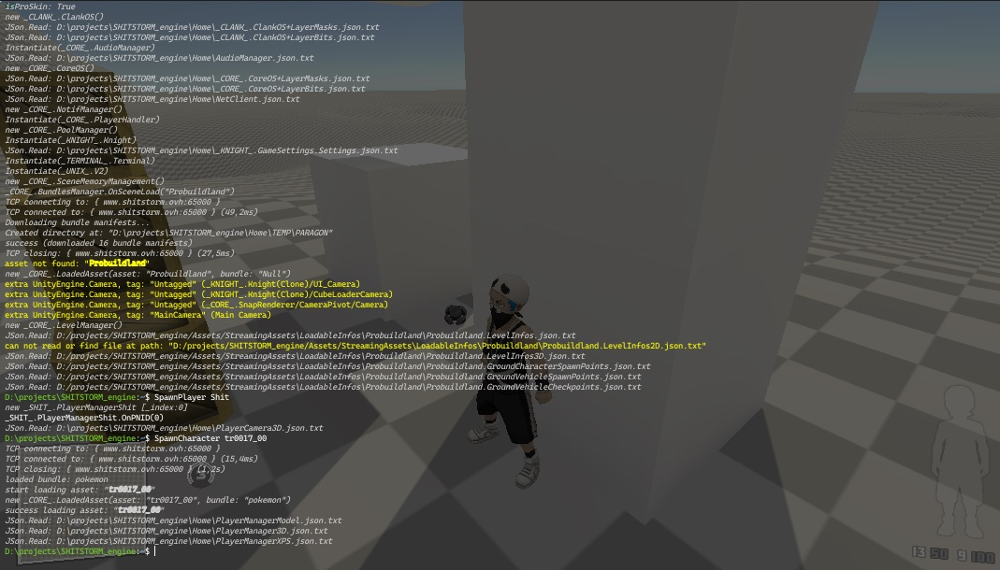

# Ingame Terminal for Unity



## Table of Contents

- [Installation](#installation)
- [License](#license)
- [Socials](#socials)
- [Games](#games)

## Installation

1. Clone these repositories in your Unity project's "Assets" folder:
    ```sh
    git clone git@github.com:RamsezII/_UTIL_.git
    git clone git@github.com:RamsezII/_ARK_.git
    ```

## License

Distributed under the MIT License. See `LICENSE` for more information.

## Socials

1. discord : https://discord.gg/MWhZSh2Pn8
2. youtube : https://www.youtube.com/channel/UCwZn5wBxBIXsPREOGw1wIAw

## Games

1. Itch.io : https://killclick.itch.io/
2. Gamejolt : https://gamejolt.com/@JediTrick/games